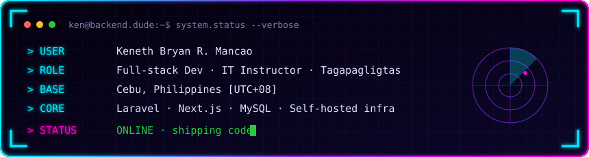

<!-- ░░░ HEADER ░░░ -->
<p align="center">
  
</p>

<p align="center">
  <a href="https://bruhh.space">
    
  </a>
</p>

<p align="center">
  <a href="https://bruhh.space"></a>
  
  
</p>

<!-- ░░░ HUD CARD ░░░ -->
<p align="center">
  
</p>


## `> cat about.ts`

```ts
const ken = {
  alias:     "backend.dude",
  role:      ["Full-Stack Developer", "IT Instructor", "Department Chair"],
  base:      "Danao City, Cebu, PH 🇵🇭",
  building:  ["Waste Management ERP", "Columbary System", "School Management System"],
  teaching:  ["Database Systems", "Web Dev", "IT Fundamentals"],
  channel:   "DevClassPH  // IT + database tutorials for college students",
  obsessed:  ["clean schemas", "RBAC", "self-hosting", "shipping fast"],
  motto:     "why use many token when few token do trick 🪨",
};
```


## `> ls ./stack`

<p align="center">
  <br/>
  <br/>
  
</p>


## `> ls ./projects --pinned`

<p align="center">
  <a href="https://github.com/rondinabrybry/brybry-sql-practice">
    
  </a>
  <a href="https://github.com/rondinabrybry/laravel-notifly">
    
  </a>
  <a href="https://github.com/rondinabrybry/rich-text-editor">
    
  </a>
  <a href="https://github.com/rondinabrybry/caveman">
    
  </a>
</p>


## `> ./telemetry --live`

<p align="center">
  
  
</p>

<p align="center">
  
</p>

<p align="center">
  
</p>

<p align="center">
  
</p>

<!-- snake: needs .github/workflows/snake.yml to run once -->
<picture>
  <source media="(prefers-color-scheme: dark)" srcset="https://raw.githubusercontent.com/rondinabrybry/rondinabrybry/output/snake-dark.svg" />
  <source media="(prefers-color-scheme: light)" srcset="https://raw.githubusercontent.com/rondinabrybry/rondinabrybry/output/snake-light.svg" />
  
</picture>


## `> ping ken`

<p align="center">
  <a href="https://bruhh.space"></a>
  <a href="https://www.youtube.com/@DevClassPH"></a>
  <a href="https://www.facebook.com/DevClassPH"></a>
  <a href="mailto:rondinabrybry1@gmail.com"></a>
</p>

<!-- ░░░ FOOTER ░░░ -->
<p align="center">
  
</p>
